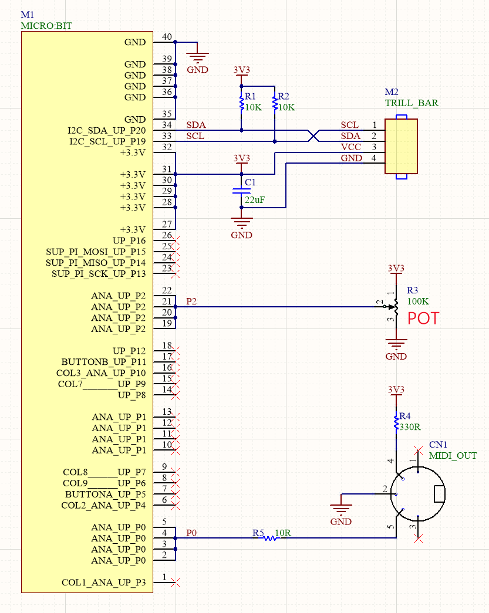

# MidiBar: a touchbar midi Controller

## Introduction

This is a midi controller with a BBC Micro:Bit and Trill Bar combination. With the touch bar, users can easily trigger and adjust notes, with a pitch range of up to two octaves and support for up to 5 touch points. The controller also boasts the ability to adjust each note's velocity and pitch, with MIDI messages sent via MIDI Polyphonic Expression (MPE).

The onboard 5x5 LED matrix of the Micro:Bit displays the change in velocity of each touch point, providing visual feedback. The external potentiometer is to send MIDI CC from 0 to 127, while the channel of MIDI CC can be adjusted using Button A and B on the Micro:Bit.

## Quick Start

[firmware](https://github.com/DCisHurt/midiBar/releases/tag/v1.0.0)</br>
[schematic](doc/Schematic.pdf)</br>

All Midi message parameters are defined at the beginning of the script

```ts
let baseNote = 48
let octaveScale = 2
let shiftThreshold = 10
let velocity = 127
let ccReg = 2
```

## Edit this project

To edit this repository in MakeCode.

* open [MakeCode micro:bit](https://makecode.microbit.org/)
* click on **Import** then click on **Import URL**
* paste **<https://github.com/DCisHurt/midiBar>** and click import

## Local Build

1. Install [Node.js](https://nodejs.org/en/download)

2. Clone this repository

    ```cmd
    git clone https://github.com/DCisHurt/midiBar.git
    ```

3. Install the MakeCode command line tool (add sudo on macOS)

    ```cmd
    npm install -g pxt
    ```

4. Install depences

    ```cmd
    pxt install
    ```

5. Build project

    ```cmd
    pxt build
    ```

## Schematic

<div align="center"></div>

## Depences

* [pxt-microbit](https://github.com/microsoft/pxt-microbit)
* [pxt-Trill](https://github.com/DCisHurt/pxt-Trill)

## License

MIT
